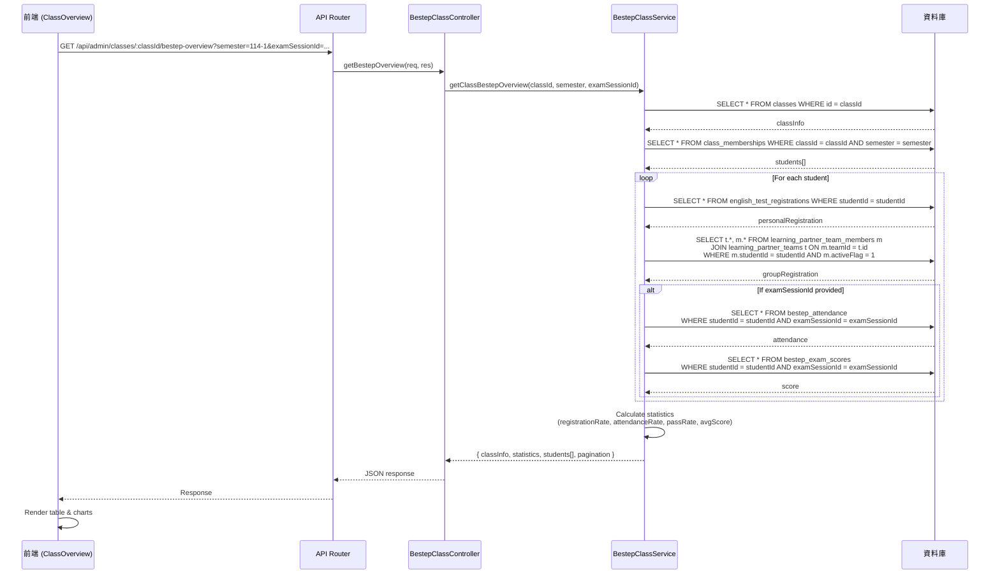
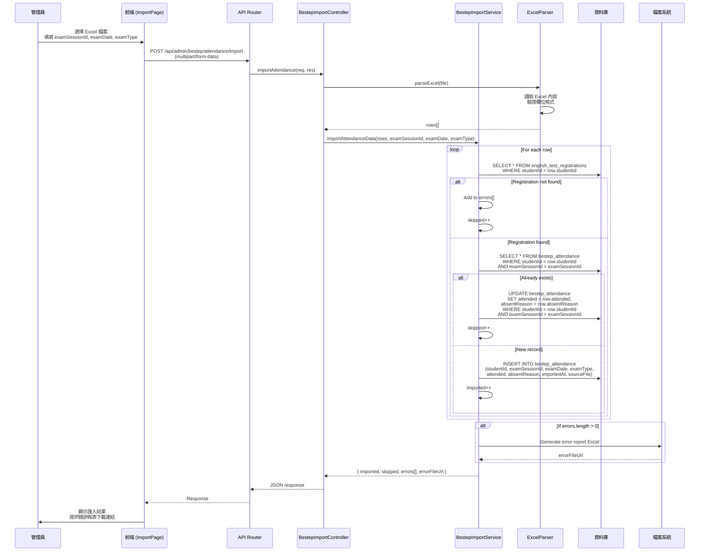
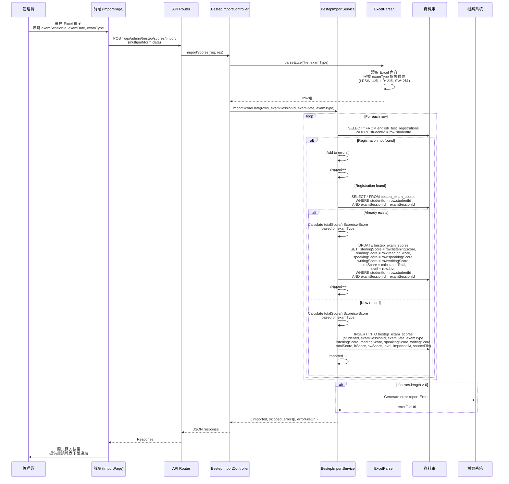
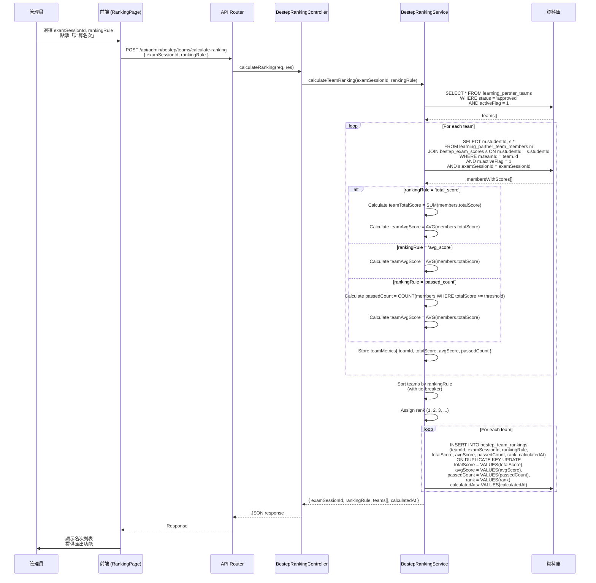
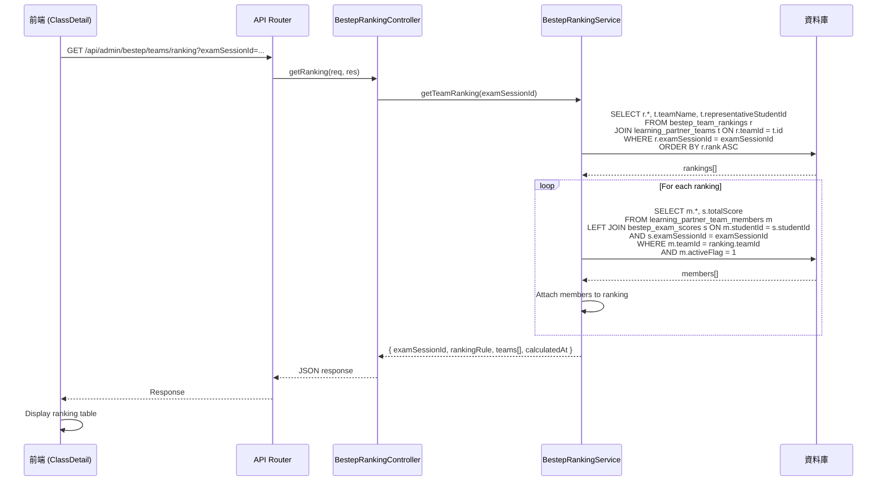
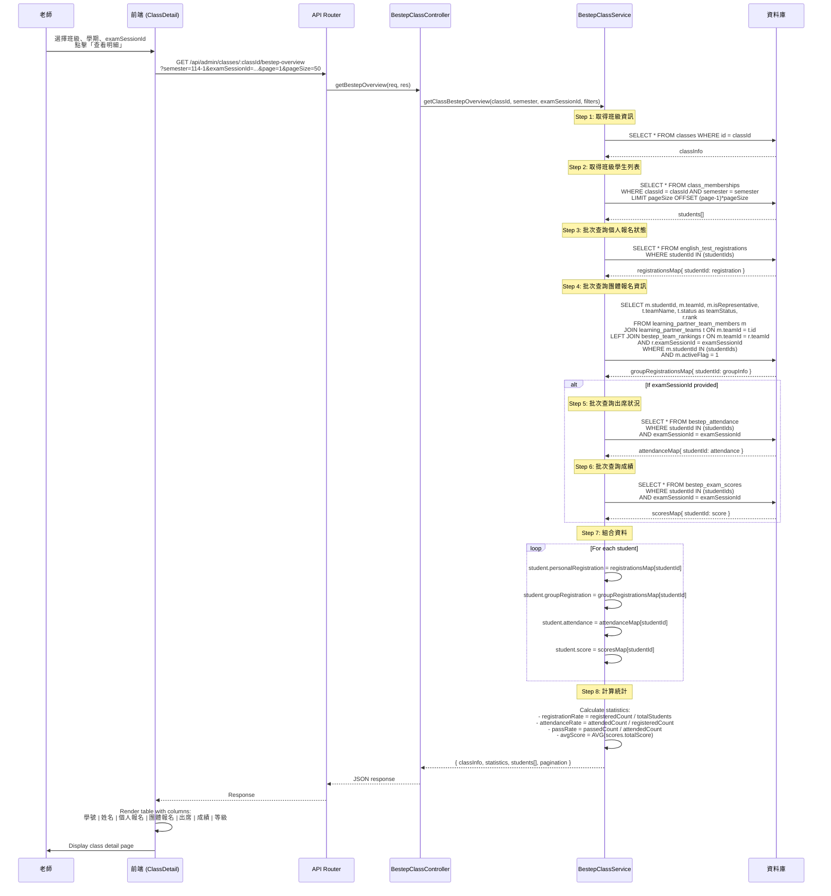
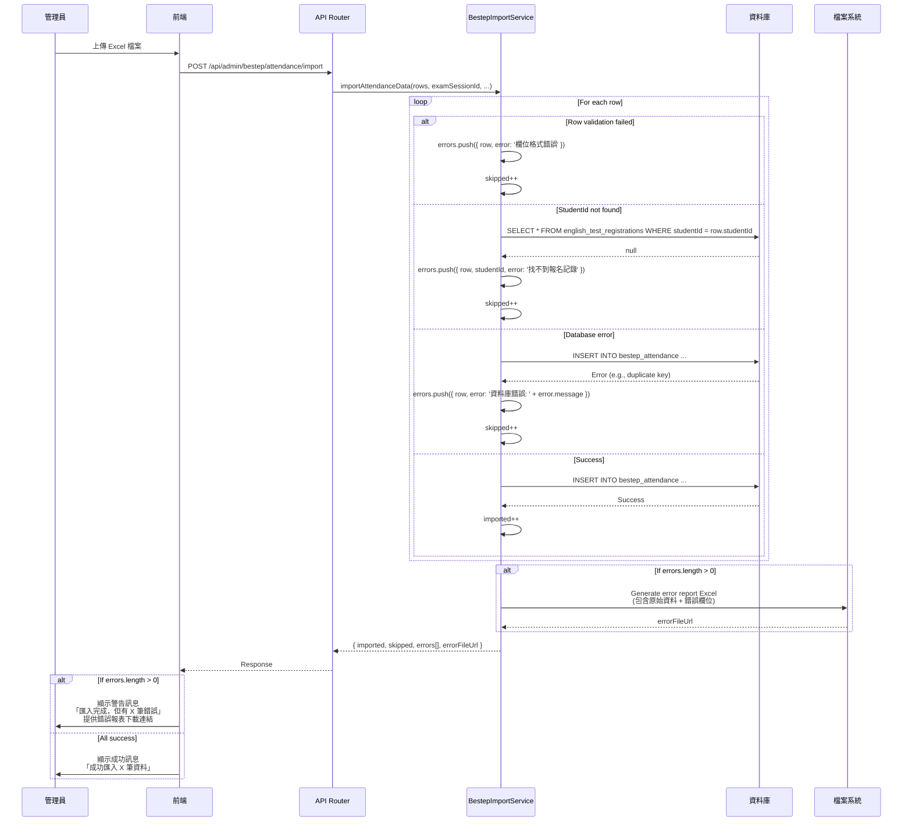
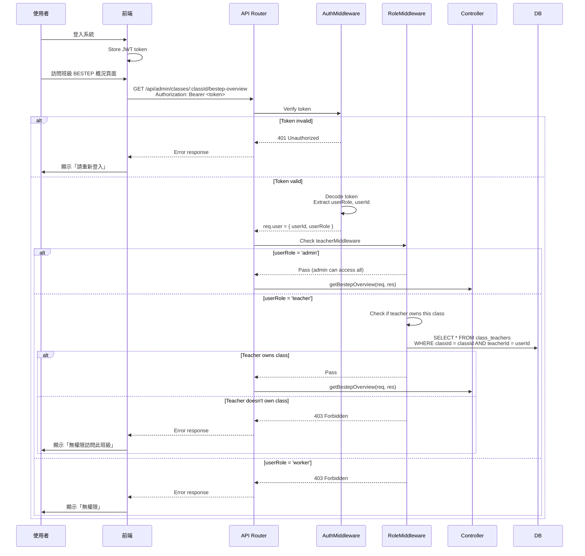

# BESTEP 整合流程圖（Sequence Diagrams）

## 1. 班級 BESTEP 概況查詢流程

---

## 2. 出席資料匯入流程

---

## 3. 成績資料匯入流程

---

## 4. 團體名次計算流程

---

## 5. 查詢團體名次流程

---

## 6. 班級明細頁面資料載入流程（整合版）

---

## 7. 錯誤處理流程（匯入時）

---

## 8. 權限檢查流程

---

**文件完成時間**: 2025-02-03
**文件版本**: v1.0
