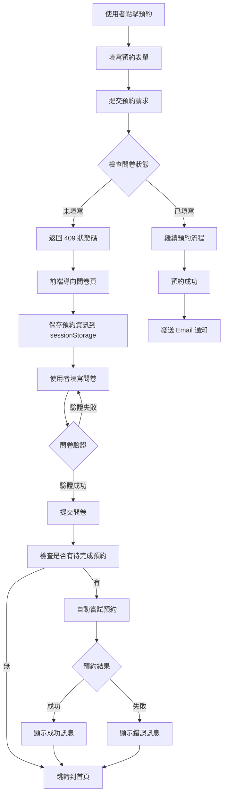
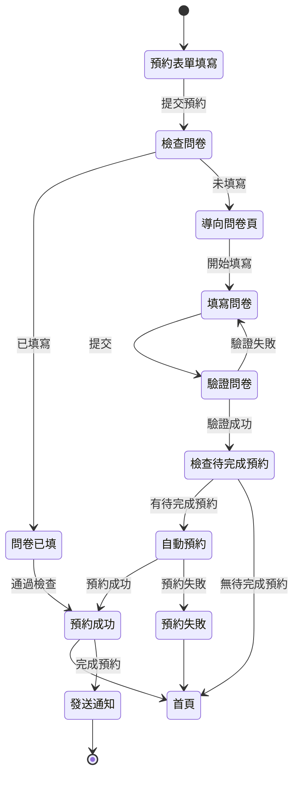

# 問卷 Gate 流程圖

## 流程概述

問卷 Gate 功能確保學生在預約活動前必須完成對應的問卷（本學期一次）。

## 流程圖（Mermaid）



## 狀態轉移圖



## 資料流

### 1. 預約請求階段

```
前端 EventDetail.js
  ↓
POST /api/reservations
  ↓
middleware: checkSurvey
  ↓
檢查問卷狀態
  ↓
[已填] → 繼續預約
[未填] → 返回 409 + redirectUrl
```

### 2. 問卷填寫階段

```
前端 SurveyPage.js
  ↓
載入問卷配置 (surveys.json)
  ↓
從 localStorage 取得學生資訊
  ↓
填寫問卷
  ↓
POST /api/surveys/:surveyId
  ↓
後端驗證並儲存
```

### 3. 自動回跳預約階段

```
問卷完成
  ↓
檢查 sessionStorage.pendingReservation
  ↓
[有] → 自動 POST /api/reservations
  ↓
顯示結果
  ↓
清除 sessionStorage
  ↓
跳轉到首頁
```

## 關鍵檔案

### 後端
- `backend/middlewares/checkSurvey.js` - 問卷檢查 middleware
- `backend/routes/surveyRouter.js` - 問卷 API
- `backend/models/EnglishTableSurvey.js` - ET 問卷模型
- `backend/models/EnglishClubSurveyResponse.js` - EC 問卷模型
- `backend/models/SurveySettings.js` - 問卷設定模型

### 前端
- `frontend/src/components/EventDetail.js` - 預約表單與問卷 Gate 邏輯
- `frontend/src/components/SurveyPage.js` - 問卷頁面與自動回跳
- `frontend/src/components/DynamicSurveyModal.js` - 動態問卷表單
- `frontend/public/surveys.json` - 問卷配置

## Admin 管理功能

### 問卷開關
- 路徑：`/admin/survey-settings`
- 功能：開啟/關閉問卷 Gate
- 影響：問卷關閉時，所有學生無需填寫問卷即可預約

### 問卷狀態查詢
- 路徑：`/admin/surveys`
- 功能：查看問卷填寫統計
- 功能：匯出問卷資料 Excel

---

**文件版本**: v1.0.0
**最後更新**: 2025-01-XX

